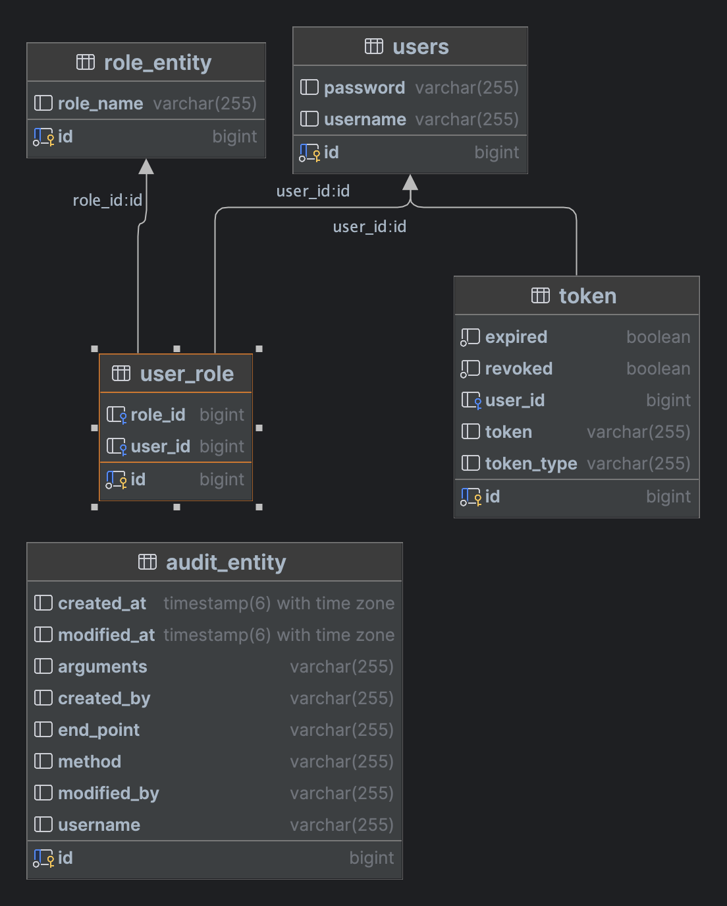

# VK Task for Internship

The following items have been implemented:
- Handlers (GET, POST, PUT, DELETE) that proxy requests
- Base authorization
- Role model (with permissions)
- Audit
- In-memory caching
- Build with maven and docker
- Database for entities and auditing
- API for creating users
- Unit-test for service layer

## Tech Stack

- Java 17
- Spring Framework (Boot, Data JPA, Security, Cache, WebFlux)
- PostgreSQL
- Docker

## Database




## Environment Variables

To run this project, you will need to add the following environment variables to your .env file

- `HOST` - host of Postgresql database
- `DB_USERNAME` - username for Postgresql database
- `DB_PASSWORD` - password for Postgresql database
- `DB_NAME` - name of Postgresql database
- `JWT_SECRET` - secret string for JWT tokens

## Run Locally

Clone the project

```bash
  git clone https://github.com/greenblat17/vk-task
```

Go to the project directory

```bash
  cd vk-task
```

Set environment variables in console or write to file

```bash
  export \
  DB_HOST=localhost \
  DB_USERNAME=username \
  DB_PASSWORD=password \
  DB_NAME=postgres \ 
  JWT_SECRET=secret
```

Start the server (first start the database)

```bash
  mvn spring-boot:run
```

## Run with docker (doesn't work for unknown reasons)

```bash
docker compose up -d
```

## Running Tests

To run tests, run the following command

```bash
  mvn clean test
```

## Roadmap

- Fix bug with docker compose
- Add redis for caching
- Write integration tests
- Add migrations with Liquibase